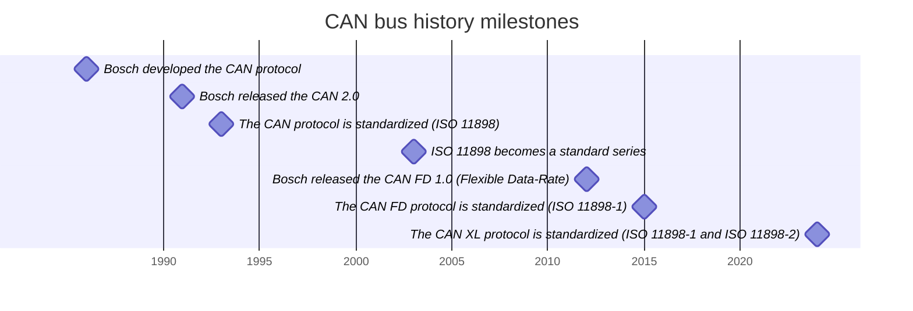

## Table of contents

- [Table of contents](#table-of-contents)
- [Definition](#definition)
- [Why use CAN bus?](#why-use-can-bus)
- [CAN protocol on OSI model](#can-protocol-on-osi-model)
- [Standard frame composition](#standard-frame-composition)
  - [Frame types](#frame-types)
- [CAN topologies](#can-topologies)
- [CAN history](#can-history)
- [CAN standard overview](#can-standard-overview)
- [References](#references)
- [Useful tools](#useful-tools)

## Definition

The CAN bus (Controller Area Network) **is a field bus communication protocol**. The bus is **composed of nodes**, called ECUs (Electronic Control Units), and **allows** them to **share data easily, without needing separate connections**. A **node broadcasts information through two wires**: CAN High and CAN Low. Every **other node receives the data and decides whether to use it or ignore it**.

## Why use CAN bus?

- **Simple & low cost:** ECUs communicate through one CAN system instead of complicated individual connections, reducing errors, weight, wiring, and costs.
- **Centralized control but decentralized communication:** The CAN bus lets you access all network ECUs from a single point, making diagnostics, data logging, and configuration easier. And nodes can communicate without requiring a central host computer.
- **Highly reliable:** The system is robust towards electric disturbances and electromagnetic interference -> ideal for safety critical applications. CAN bus has robust error detection mechanisms and automatic retransmission for corrupted messages.
- **Efficient:** CAN frames are prioritized by ID, ensuring high-priority information reaches the system without delays or interruptions of other frames.

[TODO imágenes de apoyo]

## CAN protocol on OSI model

CAN bus doesn’t fully map to all layers of the OSI model because its primary design focuses on embedded systems' real-time communication requirements, rather than generic networking. CAN bus fit into the first two layers of OSI model:

_CAN data link and physical sub-layers in relation to the OSI model_

## Standard frame composition

{: .light}
{: .dark}
_Standard CAN bus frame (without stuff bits)_

Frame field explained:

- **SOF (Start of Frame):** This marks the beginning of the CAN frame. A “dominant 0” signals to tell other nodes that a CAN node wants to start communication.
- **ID (Identifier):** Sets the message’s priority. The lower the number -> the higher the priority.
  - Base frame format, CAN 2.0A, with 11 identifier bits (used by CANopen).
  - Extended frame format, CAN 2.0B, have 29 identifier bits (used by J1939).
- **RTR (Remote Transmission Request):** Shows whether the node is sending data or requesting data from another node.
- **Control:** Holds two important elements
  - **IDE (Identifier Extension Bit):** A “dominant 0” indicates an 11-bit identifier.
  - **DLC (Data Length Code):** 4 bits specifying the number of data bytes to be sent (from 0 to 8).
- **Data:** Contains the payload. This is where signals are placed for extraction and decoding.
- **CRC (Cyclic Redundancy Check):** Used to ensure data integrity.
- **ACK:** Shows that a node has successfully received and acknowledged the data.
- **EOF (End of Frame):** Marks the end of the CAN frame. Must be "recessive 1".
- **IFS (Inter-frame spacing):** Must be "recessive 1".

>Take into account that: "dominant" state = CAN-H > CAN-L and "recessive" state = CAN-H ≤ CAN-L
{: .prompt-info }

### Frame types

CAN has four frame types:

- **Data frame:** a frame containing node data for transmission.
- **Remote frame:** a frame requesting the transmission of a specific identifier.
- **Error frame:** a frame transmitted by any node detecting an error.
- **Overload frame:** a frame to inject a delay between data or remote frame.

## CAN topologies

There are two main topologies depending on user requeriments:

- **High-speed CAN** (ISO 11898-2) works up to 1 Mbit/s (regular CAN) and 5 Mbit/s (CAN-FD). It uses a **linear bus** with a **120 Ω resistor at each end**.
- **Low-speed** or fault-tolerant CAN (ISO 11898-3), works up to 125 kbit/s. Uses **different wiring options**: linear bus, star bus, or a mix of both. Each node (device) is connected with part of the total termination resistance; the total should be close to (but not less than) 100 Ω.

{: .light}
{: .dark}
_Basic CAN topologies_

## CAN history

## CAN standard overview

- ISO 11898 series. Road vehicles — Controller area network (CAN):
  - Part 1: Data link layer and physical signalling
  - Part 2: High-speed medium access unit
  - Part 3: Low-speed, fault-tolerant, medium-dependent interface
  - Part 4: Time-triggered communication
  - Part 5: High-speed medium access unit with low-power mode
  - Part 6: High-speed medium access unit with selective wake-up functionality
- ISO 16845 series. Road vehicles — Controller area network (CAN) conformance test plan:
  - Part 1: Data link layer and physical signalling
  - Part 2: High-speed medium access unit — Conformance test plan

## References

- [CAN Bus Explained - A Simple Intro](https://www.csselectronics.com/pages/can-bus-simple-intro-tutorial){:target="_blank"}
- [History of CAN technology by CiA](https://www.can-cia.org/can-knowledge/history-of-can-technology){:target="_blank"}
- [Controller Area Network classic (CAN CC)](https://www.can-cia.org/can-knowledge/can-cc){:target="_blank"}
- [Introduction to CAN by Vector](https://elearning.vector.com/mod/page/view.php?id=333){:target="_blank"}
- <https://en.wikipedia.org/wiki/CAN_bus>{:target="_blank"}

## Useful tools

- [can-utils -> Linux-CAN / SocketCAN user space applications](https://www.github.com/linux-can/can-utils){:target="_blank"}
- [PCAN-View -> Windows Software for Displaying CAN and CAN FD Messages](https://www.peak-system.com/PCAN-View.242.0.html?L=1){:target="_blank"}
