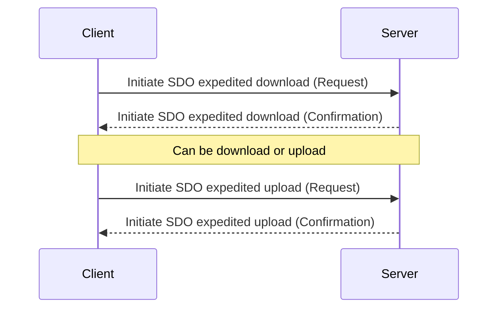
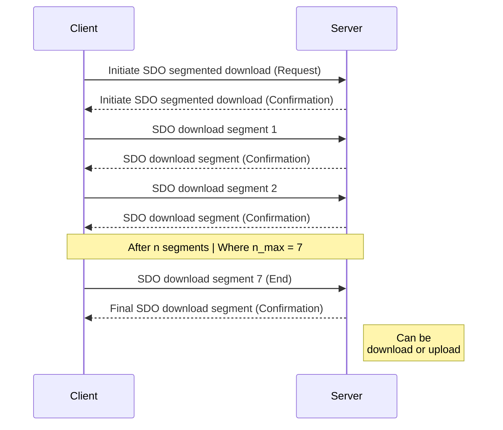
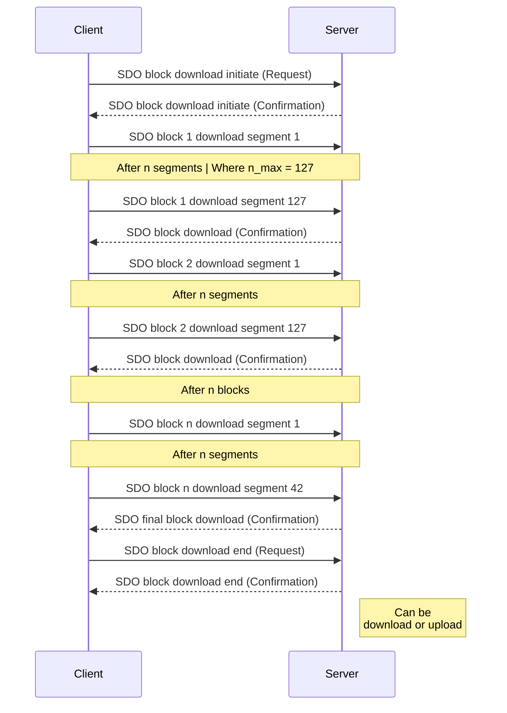
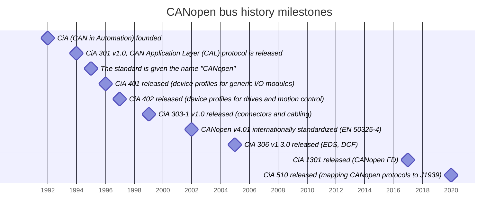

## Table of contents

- [Table of contents](#table-of-contents)
- [Definition](#definition)
- [CANopen protocol on OSI model](#canopen-protocol-on-osi-model)
- [Basic CANopen Device Model](#basic-canopen-device-model)
- [Communication models](#communication-models)
  - [Master/Slave](#masterslave)
  - [Producer/Consumer](#producerconsumer)
  - [Client/Server](#clientserver)
- [CANopen CAN frame](#canopen-can-frame)
- [Communication objects: Communication protocols and services](#communication-objects-communication-protocols-and-services)
  - [Process Data Object (PDO)](#process-data-object-pdo)
  - [Service Data Object (SDO)](#service-data-object-sdo)
  - [Special Protocols](#special-protocols)
    - [Network Management (NMT)](#network-management-nmt)
      - [Node states machine](#node-states-machine)
    - [Synchronization Object (SYNC)](#synchronization-object-sync)
    - [Time Stamp Object (TIME)](#time-stamp-object-time)
    - [Emergency Object (EMCY)](#emergency-object-emcy)
    - [NMT Error Control: Node Guarding and Heartbeat](#nmt-error-control-node-guarding-and-heartbeat)
      - [Node guarding](#node-guarding)
      - [HEARTBEAT](#heartbeat)
- [Object Dictionary (OD)](#object-dictionary-od)
  - [Electronic Data Sheet (EDS): Human-readable form of Object Dictionary (by CiA 306)](#electronic-data-sheet-eds-human-readable-form-of-object-dictionary-by-cia-306)
- [Cable connectors (by CiA 303-1)](#cable-connectors-by-cia-303-1)
- [CANopen history](#canopen-history)
- [CAN bus standard overview](#can-bus-standard-overview)
- [References](#references)
- [Useful tools](#useful-tools)

## Definition

**CANopen is a CAN based communication protocol.** It is a **"Layer 7" CAN protocol** that defines communication and device functions for CAN-based systems. Designed for very flexible configurable embedded networks. CANopen specifies the basic communication mechanisms and device profiles, but also application profiles with specific support for selected application fields.

Maintained by CAN in Automation (CiA) organization.

Mostly used in Automotive, factory automation, off-road vehicles, maritime electronics, medical equipment, and railways.

These are some of the **core specs** you should know about CANopen:

- Max. Number of Nodes = 127
- Baudrates [kBit/sec] = 10-1000
- [Node's states](#node-states-machine)
- [Process Data Object (PDO)](#process-data-object-pdo)
- What is an [Object Dictionary (OD)](#object-dictionary-od) and an [Electronic Data Sheet (EDS)](#electronic-data-sheet-eds-human-readable-form-of-object-dictionary-by-cia-306)
- `Little endian` encoding = Multi-byte parameters are always sent LSB first

<details>
<summary>See an Transfer syntax for data type INTEGERn</summary>
<table><thead>
  <tr>
    <th>octet number</th>
    <th>1</th>
    <th>2</th>
    <th>3</th>
    <th>4</th>
    <th>5</th>
    <th>6</th>
    <th>7</th>
    <th>8</th>
  </tr></thead>
<tbody>
  <tr>
    <td>INTEGER8</td>
    <td>b7..b0</td>
    <td></td>
    <td></td>
    <td></td>
    <td></td>
    <td></td>
    <td></td>
    <td></td>
  </tr>
  <tr>
    <td>INTEGER16</td>
    <td>b7..b0</td>
    <td>b15..b8</td>
    <td></td>
    <td></td>
    <td></td>
    <td></td>
    <td></td>
    <td></td>
  </tr>
  <tr>
    <td>INTEGER24</td>
    <td>b7..b0</td>
    <td>b15..b8</td>
    <td>b23..b16</td>
    <td></td>
    <td></td>
    <td></td>
    <td></td>
    <td></td>
  </tr>
  <tr>
    <td>INTEGER32</td>
    <td>b7..b0</td>
    <td>b15..b8</td>
    <td>b23..b16</td>
    <td>b31..b24</td>
    <td></td>
    <td></td>
    <td></td>
    <td></td>
  </tr>
  <tr>
    <td>INTEGER40</td>
    <td>b7..b0</td>
    <td>b15..b8</td>
    <td>b23..b16</td>
    <td>b31..b24</td>
    <td>b39..b32</td>
    <td></td>
    <td></td>
    <td></td>
  </tr>
  <tr>
    <td>INTEGER48</td>
    <td>b7..b0</td>
    <td>b15..b8</td>
    <td>b23..b16</td>
    <td>b31..b24</td>
    <td>b39..b32</td>
    <td>b47..b40</td>
    <td></td>
    <td></td>
  </tr>
  <tr>
    <td>INTEGER56</td>
    <td>b7..b0</td>
    <td>b15..b8</td>
    <td>b23..b16</td>
    <td>b31..b24</td>
    <td>b39..b32</td>
    <td>b47..b40</td>
    <td>b55..b48</td>
    <td></td>
  </tr>
  <tr>
    <td>INTEGER64</td>
    <td>b7..b0</td>
    <td>b15..b8</td>
    <td>b23..b16</td>
    <td>b31..b24</td>
    <td>b39..b32</td>
    <td>b47..b40</td>
    <td>b55..b48</td>
    <td>b63..b56</td>
  </tr>
</tbody></table>
</details>

## CANopen protocol on OSI model

CANopen (CiA 301) only defines the application layer, based on CAN bus:


_CANopen Application layer with CAN protocol layers in relation to the OSI model_

>CAN acts like a telephone line enabling communication, while CANopen is like the language spoken over that line.
{: .prompt-tip }

## Basic CANopen Device Model

A device is structured like the following:

- **Communication interface:** This part sends and receives data over the network.
- **Object Dictionary:** A list of all data items (information) that controls how the device works and communicates.
- **Application:** The main function of the device for the interaction with the process environment.

{: .light}
{: .dark}
_Device Model_

## Communication models

On CANopen three different communication models are used. Each one closely linked to the CANopen communication protocols.

{: .light}
{: .dark}
_CANopen communication models_

### Master/Slave

**One node** (master) controls the communication by requesting or sending data **to *all* other nodes** (slaves). This setup is mostly used for tasks like diagnostics, configuration, or managing states. The system can include 0-127 slaves.

Protocol that use it: NMT.

### Producer/Consumer

A **producer** node **broadcasts data to** the network to zero or more **consumer(s)**. There are two options:

- *push model:* The producer send data without been requested.
- *pull model:* The producer send data by a consumer request.

Protocol that use it: PDO, HEARTBEAT, SYNC, TIME, EMCY.

### Client/Server

A client send a request (upload/download) triggering the server to perform a certain task.

>- Upload: Client read from a server.
>- Download: Client write to a server.
{: .prompt-info }

Protocol that use it: SDO.

## CANopen CAN frame

CANopen gives meaning to the arbitration part of a CAN frame and defines how to encode its data part.

{: .light}
{: .dark}
_CANopen data over CAN frame_

The 11 bits of the CAN ID correspond to the CANopen COB-ID, which is divided into two parts: the first 4 bits are the function code, and the remaining 7 bits are the node ID.

<details>
<summary>See pre-defined COB-IDs used in CANopen.</summary>
<table><thead>
  <tr>
    <th>Communication object </th>
    <th>Function code [bin]</th>
    <th>Node ID [bin (hex)]</th>
    <th>Generic COB-ID [hex]</th>
    <th>Resulting COB-ID [dec (hex)]</th>
    <th>Communication Parameters at Index</th>
  </tr></thead>
<tbody>
  <tr>
    <td>NMT </td>
    <td>0000</td>
    <td>0</td>
    <td>0h</td>
    <td>0</td>
    <td>-</td>
  </tr>
  <tr>
    <td>SYNC </td>
    <td>0001</td>
    <td>0</td>
    <td>80h</td>
    <td>128 (80h) </td>
    <td>1005h, 1006h, 1007h</td>
  </tr>
  <tr>
    <td>TIME STAMP </td>
    <td>0010</td>
    <td>0</td>
    <td>100h</td>
    <td>256 (100h) </td>
    <td>1012h, 1013h</td>
  </tr>
  <tr>
    <td>EMERGENCY </td>
    <td>0001</td>
    <td>0000001 (1h) – 1111111(127h)</td>
    <td>80h + Node ID</td>
    <td>129 (81h) – 255 (FFh) </td>
    <td>1014h, 1015h</td>
  </tr>
  <tr>
    <td>TPDO1</td>
    <td>0011</td>
    <td>0000001 (1h) – 1111111(127h)</td>
    <td>180h + Node ID</td>
    <td>385 (181h) – 511 (1FFh) </td>
    <td>1800h</td>
  </tr>
  <tr>
    <td>RPDO1</td>
    <td>0100</td>
    <td>0000001 (1h) – 1111111(127h)</td>
    <td>200h + Node ID</td>
    <td>513 (201h) – 639 (27Fh) </td>
    <td>1400h</td>
  </tr>
  <tr>
    <td>TPDO2</td>
    <td>0101</td>
    <td>0000001 (1h) – 1111111(127h)</td>
    <td>280h + Node ID</td>
    <td>641 (281h) – 767 (2FFh) </td>
    <td>1801h</td>
  </tr>
  <tr>
    <td>RPDO2</td>
    <td>0110</td>
    <td>0000001 (1h) – 1111111(127h)</td>
    <td>300h + Node ID</td>
    <td>769 (301h) – 895 (37Fh) </td>
    <td>1401h</td>
  </tr>
  <tr>
    <td>TPDO3</td>
    <td>0111</td>
    <td>0000001 (1h) – 1111111(127h)</td>
    <td>380h + Node ID</td>
    <td>897 (381h) – 1023 (3FFh) </td>
    <td>1802h</td>
  </tr>
  <tr>
    <td>RPDO3</td>
    <td>1000</td>
    <td>0000001 (1h) – 1111111(127h)</td>
    <td>400h + Node ID</td>
    <td>1025 (401h) – 1151 (47Fh) </td>
    <td>1402h</td>
  </tr>
  <tr>
    <td>TPDO4</td>
    <td>1001</td>
    <td>0000001 (1h) – 1111111(127h)</td>
    <td>480h + Node ID</td>
    <td>1153 (481h) – 1279 (4FFh) </td>
    <td>1803h</td>
  </tr>
  <tr>
    <td>RPDO4</td>
    <td>1010</td>
    <td>0000001 (1h) – 1111111(127h)</td>
    <td>500h + Node ID</td>
    <td>1281 (501h) – 1407 (57Fh) </td>
    <td>1403h</td>
  </tr>
  <tr>
    <td>TSDO </td>
    <td>1011</td>
    <td>0000001 (1h) – 1111111(127h)</td>
    <td>580h + Node ID</td>
    <td>1409 (581h) – 1535 (5FFh) </td>
    <td>1200h</td>
  </tr>
  <tr>
    <td>RSDO </td>
    <td>1100</td>
    <td>0000001 (1h) – 1111111(127h)</td>
    <td>600h + Node ID</td>
    <td>1537 (601h) – 1663 (67Fh) </td>
    <td>1200h</td>
  </tr>
  <tr>
    <td>HEARTBEAT (NMT Error Control)</td>
    <td>1110</td>
    <td>0000001 (1h) – 1111111(127h)</td>
    <td>700h + Node ID</td>
    <td>1793 (701h) – 1919 (77Fh) </td>
    <td>1016h, 1017h</td>
  </tr>
</tbody></table>
</details>

## Communication objects: Communication protocols and services

### Process Data Object (PDO)

Used for **real-time data transfer**. PDO **can contain 8 bytes of data** and multiple object parameter values in a single frame.

'Consumer/producer' protocol is used and there are two kinds of PDO:

- Transmit-PDO (TPDO) -> Node acts as producer
- Receive-PDO (RPDO) -> Node acts as consumer

The following PDO transmission modes are distinguished:

- Synchronous transmission (in response to a SYNC)
  - Cyclic: Transmission is triggered periodically after every 1, 2 or up to 240 SYNC messages
  - Acyclic: Synchronized with SYNC
- Asynchronous
  - Event-driven transmission (e.g. periodically, with an application event...)
  - Remotely requested PDO (Legacy, no recommended)

{: .light}
{: .dark}
_CANopen PDO transmission modes_

Data type and mapping of application objects into a PDO is determined by a corresponding default PDO mapping structure within the Object Dictionary (OD).

>If variable PDO mapping is supported the configuration process is done by the SDO services to the corresponding objects of the OD.
{: .prompt-info }

### Service Data Object (SDO)

Used to **provide direct access to entries in a node’s object dictionary**, allowing transfer of data of any size/type between a client and server.

Transfer Types:

- **Expedited:** For small data sets (up to 4 bytes, fast single transfer during initialization), transfers the full payload in a single initialization/confirmation flow.
- **Segmented:** First is an initialization/confirmation step an then data is sent as a sequence of smaller parts (7 bytes of data segments).
- **Block Transfer:** For large data sets, groups segments into blocks (up to 127 segments per block) for faster transfer, with initialization and finalization/check phases.







{: .light}
{: .dark}
_CANopen generic Transmission-SDO frame example_

>All services are defined on CiA 301 section 7.2.4.2. To see every frames you can go here [CANopen high-level protocol for CAN-bus](https://www.nikhef.nl/pub/departments/ct/po/doc/CANopen30.pdf){:target="_blank"}
{: .prompt-info }

### Special Protocols

#### Network Management (NMT)

Used to **control the state of CANopen nodes**. To request a state change, the NMT master sends a 2-byte message with COB-ID = 0: the first data byte specifies the desired state, and the second byte identifies the target node by its node ID.

>Node ID = 0 indicates a broadcast command.
{: .prompt-info }

{: .light}
{: .dark}
_CANopen NMT frame example_

##### Node states machine

{: .light}
{: .dark}
_CANopen node state machine_

#### Synchronization Object (SYNC)

Periodically broadcasts a synchronization (SYNC) object that provides the basic network synchronization mechanism. Nodes that operate synchronously may use the SYNC object to synchronize their timing with the SYNC producer.

>This synchronization is usually triggered by the application master.
{: .prompt-info }

The SYNC frame has the COB-ID = 080. And the data field may include a SYNC counter, used to explicitly associate the current SYNC cycle with PDO transmission.

>Using the SYNC counter several groups of synchronously operating devices can be configured.
{: .prompt-type }

#### Time Stamp Object (TIME)

This function is used to **provide global network time**.

The frame has COB-ID = 100 and contains 6 data bytes: the first four bytes represent the time in milliseconds since midnight, and the next two bytes show the number of days since January 1, 1984.

#### Emergency Object (EMCY)

Used in case a device experiences a fatal error, sending broadcasts frame to indicate this to the rest of the network.

>Take into account that the EMCY is optional.
{: .prompt-info }

<details>
<summary>See data bytes emergency error code classes.</summary>
<table><thead>
  <tr>
    <th>Error code </th>
    <th>Description</th>
  </tr></thead>
<tbody>
  <tr>
    <td>00xxh </td>
    <td>Error reset or no error</td>
  </tr>
  <tr>
    <td>10xxh </td>
    <td>Generic error</td>
  </tr>
  <tr>
    <td>20xxh </td>
    <td>Current</td>
  </tr>
  <tr>
    <td>21xxh </td>
    <td>Current, CANopen device input side</td>
  </tr>
  <tr>
    <td>22xxh </td>
    <td>Current inside the CANopen device</td>
  </tr>
  <tr>
    <td>23xxh </td>
    <td>Current, CANopen device output side</td>
  </tr>
  <tr>
    <td>30xxh </td>
    <td>Voltage</td>
  </tr>
  <tr>
    <td>31xxh </td>
    <td>Mains voltage</td>
  </tr>
  <tr>
    <td>32xxh </td>
    <td>Voltage inside the CANopen device</td>
  </tr>
  <tr>
    <td>33xxh </td>
    <td>Output voltage</td>
  </tr>
  <tr>
    <td>40xxh </td>
    <td>Temperature</td>
  </tr>
  <tr>
    <td>41xxh </td>
    <td>Ambient temperature</td>
  </tr>
  <tr>
    <td>42xxh </td>
    <td>CANopen device temperature</td>
  </tr>
  <tr>
    <td>50xxh </td>
    <td>CANopen device hardware</td>
  </tr>
  <tr>
    <td>60xxh </td>
    <td>CANopen device software</td>
  </tr>
  <tr>
    <td>61xxh </td>
    <td>Internal software</td>
  </tr>
  <tr>
    <td>62xxh </td>
    <td>User software</td>
  </tr>
  <tr>
    <td>63xxh </td>
    <td>Data set</td>
  </tr>
  <tr>
    <td>70xxh </td>
    <td>Additional modules</td>
  </tr>
  <tr>
    <td>80xxh </td>
    <td>Monitoring</td>
  </tr>
  <tr>
    <td>81xxh </td>
    <td>Communication</td>
  </tr>
  <tr>
    <td>82xxh </td>
    <td>Protocol error</td>
  </tr>
  <tr>
    <td>90xxh </td>
    <td>External error</td>
  </tr>
  <tr>
    <td>F0xxh </td>
    <td>Additional functions</td>
  </tr>
  <tr>
    <td>FFxxh </td>
    <td>CANopen device sp</td>
  </tr>
</tbody></table>
</details>

<details>
<summary>See data bytes emergency error codes.</summary>
<table><thead>
  <tr>
    <th>Error code </th>
    <th>Description</th>
  </tr></thead>
<tbody>
  <tr>
    <td>0000h </td>
    <td>Error reset or no error</td>
  </tr>
  <tr>
    <td>1000h </td>
    <td>Generic error</td>
  </tr>
  <tr>
    <td>2000h </td>
    <td>Current – generic error</td>
  </tr>
  <tr>
    <td>2100h </td>
    <td>Current, CANopen device input side – generic</td>
  </tr>
  <tr>
    <td>2200h </td>
    <td>Current inside the CANopen device – generic</td>
  </tr>
  <tr>
    <td>2300h </td>
    <td>Current, CANopen device output side – generic</td>
  </tr>
  <tr>
    <td>3000h </td>
    <td>Voltage – generic error</td>
  </tr>
  <tr>
    <td>3100h </td>
    <td>Mains voltage – generic</td>
  </tr>
  <tr>
    <td>3200h </td>
    <td>Voltage inside the CANopen device – generic</td>
  </tr>
  <tr>
    <td>3300h </td>
    <td>Output voltage – generic</td>
  </tr>
  <tr>
    <td>4000h </td>
    <td>Temperature – generic error</td>
  </tr>
  <tr>
    <td>4100h </td>
    <td>Ambient temperature – generic</td>
  </tr>
  <tr>
    <td>4200h </td>
    <td>Device temperature – generic</td>
  </tr>
  <tr>
    <td>5000h </td>
    <td>CANopen device hardware – generic error</td>
  </tr>
  <tr>
    <td>6000h </td>
    <td>CANopen device software – generic error</td>
  </tr>
  <tr>
    <td>6100h </td>
    <td>Internal software – generic</td>
  </tr>
  <tr>
    <td>6200h </td>
    <td>User software – generic</td>
  </tr>
  <tr>
    <td>6300h </td>
    <td>Data set – generic</td>
  </tr>
  <tr>
    <td>7000h </td>
    <td>Additional modules – generic error</td>
  </tr>
  <tr>
    <td>8000h </td>
    <td>Monitoring – generic error</td>
  </tr>
  <tr>
    <td>8100h </td>
    <td>Communication – generic</td>
  </tr>
  <tr>
    <td>8110h </td>
    <td>CAN overrun (objects lost)</td>
  </tr>
  <tr>
    <td>8120h </td>
    <td>CAN in error passive mode</td>
  </tr>
  <tr>
    <td>8130h </td>
    <td>Life guard error or heartbeat error</td>
  </tr>
  <tr>
    <td>8140h </td>
    <td>recovered from bus off</td>
  </tr>
  <tr>
    <td>8150h </td>
    <td>CAN-ID collision</td>
  </tr>
  <tr>
    <td>8200h </td>
    <td>Protocol error - generic</td>
  </tr>
  <tr>
    <td>8210h </td>
    <td>PDO not processed due to length error</td>
  </tr>
  <tr>
    <td>8220h </td>
    <td>PDO length exceeded</td>
  </tr>
  <tr>
    <td>8230h </td>
    <td>DAM MPDO not processed, destinationobject not available</td>
  </tr>
  <tr>
    <td>8240h </td>
    <td>Unexpected SYNC data length</td>
  </tr>
  <tr>
    <td>8250h </td>
    <td>RPDO timeout</td>
  </tr>
  <tr>
    <td>9000h </td>
    <td>External error – generic error</td>
  </tr>
  <tr>
    <td>F000h </td>
    <td>Additional functions – generic error</td>
  </tr>
  <tr>
    <td>FF00h </td>
    <td>Device specific – generic error</td>
  </tr>
</tbody></table>
</details>

#### NMT Error Control: Node Guarding and Heartbeat

**To know nodes status**, CANopen uses **Node Guarding and Heartbeat** to ensure devices are operational and to alert the system if communication fails. **At least one mechanism is required for network reliability.**

##### Node guarding

**The NMT master periodically sends out guarding requests to each slave**. If a slave device responds within a specified time window, it is considered healthy and connected.

>Some systems support life guarding, allowing the slave to monitor if the master is still communicating. If not, the slave alerts its own local application.
{: .prompt-info }

{: .light}
{: .dark}
_NMT Node Guarding communication workflow_

##### HEARTBEAT

In this system, devices assigned as heartbeat producers send out a special “heartbeat” broadcasts message at regular intervals and heartbeat consumers, listen for these messages.

{: .light}
{: .dark}
_NMT HEARTBEAT communication workflow_

## Object Dictionary (OD)

Attribute Description
rw        read and write access
wo        write only access
ro        read only access
const     read only access

**Standardized structure that contain node's all parameters** describing its behavior. **All nodes must have one.** OD entries are looked up via a 16-bit index and 8-bit subindex.

Each entry is described by:

- **Index:** 16-bit base address of the object
- **Object name:** Manufacturer device name
- **Object code:** Array, variable, record...
- **Data type:** BOOL, UNSIGNED32, Record Name...
- **Access attributes:** rw (read/write), ro (read-only), wo (write-only)...
- **Category:** Indicates if this parameter is mandatory/optional (M/O)

<details>
<summary>See General Object dictionary index structure.</summary>
<table><thead>
  <tr>
    <th>Index</th>
    <th>Object</th>
  </tr></thead>
<tbody>
  <tr>
    <td>0000h</td>
    <td>not used</td>
  </tr>
  <tr>
    <td>0001h – 001Fh</td>
    <td>Static data types (standard data types, e.g. Boolean, Integer16)</td>
  </tr>
  <tr>
    <td>0020h – 003Fh</td>
    <td>Complex data types (predefined structures composed of standard data types, e.g. PDOCommPar, SDOParameter)</td>
  </tr>
  <tr>
    <td>0040h – 005Fh</td>
    <td>Manufacturer-specific complex data types</td>
  </tr>
  <tr>
    <td>0060h – 025Fh</td>
    <td>Device profile specific data types</td>
  </tr>
  <tr>
    <td>0260h – 0FFFh</td>
    <td>reserved</td>
  </tr>
  <tr>
    <td>1000h – 1FFFh</td>
    <td>Communication profile area (e.g. Device Type, Error Register, Number of PDOs supported)</td>
  </tr>
  <tr>
    <td>2000h – 5FFFh</td>
    <td>Manufacturer-specific profile area</td>
  </tr>
  <tr>
    <td>6000h – 9FFFh</td>
    <td>Standardised Device Profile Area (e.g. "DSP-401 Device Profile for I/0 Modules" [3]: Read State 8 Input Lines, etc.)</td>
  </tr>
  <tr>
    <td>A000h – BFFFh</td>
    <td>Standardized network variable area</td>
  </tr>
  <tr>
    <td>C000h – FFFFh</td>
    <td>reserved</td>
  </tr>
</tbody></table>
>Don't be confused by all the 'data types' located in the OD at indices below 0FFF; they're there mainly or definition purposes only. The relevant range of a node's OD lies between 1000 and 9FFF.
</details>

<details>
<summary>See Object dictionary objects definitions.</summary>
<table><thead>
  <tr>
    <th>Object code</th>
    <th>Object name</th>
    <th>Definition</th>
  </tr></thead>
<tbody>
  <tr>
    <td>00h</td>
    <td>NULL</td>
    <td>An object with no data fields</td>
  </tr>
  <tr>
    <td>02h</td>
    <td>DOMAIN</td>
    <td>Large variable amount of data (e.g.executable program code)</td>
  </tr>
  <tr>
    <td>05h</td>
    <td>DEFTYPE</td>
    <td>Denotes a type definition such as a BOOLEAN, UNSIGNED16, FLOAT...</td>
  </tr>
  <tr>
    <td>06h</td>
    <td>DEFSTRUCT</td>
    <td>Defines a new record type (e.g. the PDO mapping structure at 21h)</td>
  </tr>
  <tr>
    <td>07h</td>
    <td>VAR</td>
    <td>Variable of a single data type (BOOL, UNSIGNED16, INTEGER8…)</td>
  </tr>
  <tr>
    <td>08h</td>
    <td>ARRAY</td>
    <td>Array of variables of the same data type</td>
  </tr>
  <tr>
    <td>09h</td>
    <td>RECORD</td>
    <td>Array of variables with different data types. Sub-index 0 has always data type UNSIGNED8 and conatins the number of elements</td>
  </tr>
</tbody></table>
</details>

<details>
<summary>See Object dictionary data types.</summary>
<table><thead>
  <tr>
    <th>Index</th>
    <th>Object</th>
    <th>Name</th>
  </tr></thead>
<tbody>
  <tr>
    <td>0001h</td>
    <td>DEFTYPE</td>
    <td>BOOLEAN</td>
  </tr>
  <tr>
    <td>0002h</td>
    <td>DEFTYPE</td>
    <td>INTEGER8</td>
  </tr>
  <tr>
    <td>0003h</td>
    <td>DEFTYPE</td>
    <td>INTEGER16</td>
  </tr>
  <tr>
    <td>0004h</td>
    <td>DEFTYPE</td>
    <td>INTEGER32</td>
  </tr>
  <tr>
    <td>0005h</td>
    <td>DEFTYPE</td>
    <td>UNSIGNED8</td>
  </tr>
  <tr>
    <td>0006h</td>
    <td>DEFTYPE</td>
    <td>UNSIGNED16</td>
  </tr>
  <tr>
    <td>0007h</td>
    <td>DEFTYPE</td>
    <td>UNSIGNED32</td>
  </tr>
  <tr>
    <td>0008h</td>
    <td>DEFTYPE</td>
    <td>REAL32</td>
  </tr>
  <tr>
    <td>0009h</td>
    <td>DEFTYPE</td>
    <td>VISIBLE_STRING</td>
  </tr>
  <tr>
    <td>000Ah</td>
    <td>DEFTYPE</td>
    <td>OCTET_STRING</td>
  </tr>
  <tr>
    <td>000Bh</td>
    <td>DEFTYPE</td>
    <td>UNICODE_STRING</td>
  </tr>
  <tr>
    <td>000Ch</td>
    <td>DEFTYPE</td>
    <td>TIME_OF_DAY</td>
  </tr>
  <tr>
    <td>000Dh</td>
    <td>DEFTYPE</td>
    <td>TIME_DIFFERENCE</td>
  </tr>
  <tr>
    <td>000Eh</td>
    <td>reserved</td>
    <td></td>
  </tr>
  <tr>
    <td>000Fh</td>
    <td>DEFTYPE</td>
    <td>DOMAIN</td>
  </tr>
  <tr>
    <td>0010h</td>
    <td>DEFTYPE</td>
    <td>INTEGER24</td>
  </tr>
  <tr>
    <td>0011h</td>
    <td>DEFTYPE</td>
    <td>REAL64</td>
  </tr>
  <tr>
    <td>0012h</td>
    <td>DEFTYPE</td>
    <td>INTEGER40</td>
  </tr>
  <tr>
    <td>0013h</td>
    <td>DEFTYPE</td>
    <td>INTEGER48</td>
  </tr>
  <tr>
    <td>0014h</td>
    <td>DEFTYPE</td>
    <td>INTEGER56</td>
  </tr>
  <tr>
    <td>0015h</td>
    <td>DEFTYPE</td>
    <td>INTEGER64</td>
  </tr>
  <tr>
    <td>0016h</td>
    <td>DEFTYPE</td>
    <td>UNSIGNED24</td>
  </tr>
  <tr>
    <td>0017h</td>
    <td>reserved</td>
    <td></td>
  </tr>
  <tr>
    <td>0018h</td>
    <td>DEFTYPE</td>
    <td>UNSIGNED40</td>
  </tr>
  <tr>
    <td>0019h</td>
    <td>DEFTYPE</td>
    <td>UNSIGNED48</td>
  </tr>
  <tr>
    <td>001Ah</td>
    <td>DEFTYPE</td>
    <td>UNSIGNED56</td>
  </tr>
  <tr>
    <td>001Bh</td>
    <td>DEFTYPE</td>
    <td>UNSIGNED64</td>
  </tr>
  <tr>
    <td>001Ch – 001Fh</td>
    <td>reserved</td>
    <td></td>
  </tr>
  <tr>
    <td>0020h</td>
    <td>DEFSTRUCT</td>
    <td>PDO_COMMUNICATION_PARAMETER</td>
  </tr>
  <tr>
    <td>0021h</td>
    <td>DEFSTRUCT</td>
    <td>PDO_MAPPING</td>
  </tr>
  <tr>
    <td>0022h</td>
    <td>DEFSTRUCT</td>
    <td>SDO_PARAMETER</td>
  </tr>
  <tr>
    <td>0023h</td>
    <td>DEFSTRUCT</td>
    <td>IDENTITY</td>
  </tr>
  <tr>
    <td>0024h – 003Fh </td>
    <td>reserved</td>
    <td></td>
  </tr>
  <tr>
    <td>0040h – 005Fh</td>
    <td>DEFSTRUCT</td>
    <td>Manufacturer-specific Complex Data types</td>
  </tr>
  <tr>
    <td>0060h – 007Fh</td>
    <td>DEFTYPE</td>
    <td>Device profile specific Standard Data types 1 st logical device</td>
  </tr>
</tbody></table>
</details>

<details>
<summary>See Access attributes for data objects</summary>
<table><thead>
  <tr>
    <th>Attribute</th>
    <th>Description</th>
  </tr></thead>
<tbody>
  <tr>
    <td>rw</td>
    <td>Read and write access</td>
  </tr>
  <tr>
    <td>rww</td>
    <td>An accessory definition of CiA 306 v1.2, read and write access to an object where writing affects directly a process output. Objects with this attribute can be mapped in a devices RPDO</td>
  </tr>
  <tr>
    <td>rwr</td>
    <td>An accessory definition of CiA 306 v1.2, read and write access to an object where reading reads a process input. Objects with this attribute can be mapped in a devices TPDO</td>
  </tr>
  <tr>
    <td>wo</td>
    <td>Write only access</td>
  </tr>
  <tr>
    <td>ro</td>
    <td>Read only access</td>
  </tr>
  <tr>
    <td>const</td>
    <td>Read only access, but the value is always the same, it's constant</td>
  </tr>
</tbody>
</table>
</details>

<details>
<summary>Exaple of an PDO records specification</summary>
PDO communication parameter record ↴
<table><thead>
  <tr>
    <th>Index</th>
    <th>Sub-index</th>
    <th>Name</th>
    <th>Data type</th>
  </tr></thead>
<tbody>
  <tr>
    <td rowspan="7">0020h</td>
    <td>00h</td>
    <td>Highest sub-index supported </td>
    <td>UNSIGNED8</td>
  </tr>
  <tr>
    <td>01h</td>
    <td>COB-ID</td>
    <td>UNSIGNED32</td>
  </tr>
  <tr>
    <td>02h</td>
    <td>Transmission type</td>
    <td>UNSIGNED8</td>
  </tr>
  <tr>
    <td>03h</td>
    <td>Inhibit time</td>
    <td>UNSIGNED16</td>
  </tr>
  <tr>
    <td>04h</td>
    <td>reserved</td>
    <td>UNSIGNED8</td>
  </tr>
  <tr>
    <td>05h</td>
    <td>Event timer</td>
    <td>UNSIGNED16</td>
  </tr>
  <tr>
    <td>06h</td>
    <td>SYNC start value</td>
    <td>UNSIGNED8</td>
  </tr>
</tbody>
</table>
PDO mapping parameter record ↴
<table><thead>
  <tr>
    <th>Index</th>
    <th>Sub-index</th>
    <th>Name</th>
    <th>Data type</th>
  </tr></thead>
<tbody>
  <tr>
    <td rowspan="5">0021h</td>
    <td>00h</td>
    <td>Number of mapped objects in PDO</td>
    <td>UNSIGNED8</td>
  </tr>
  <tr>
    <td>01h</td>
    <td>1st object to be mapped</td>
    <td>UNSIGNED32</td>
  </tr>
  <tr>
    <td>02h</td>
    <td>2nd object to be mapped</td>
    <td>UNSIGNED32</td>
  </tr>
  <tr>
    <td colspan="3">…</td>
  </tr>
  <tr>
    <td>04h</td>
    <td>2nd object to be mapped</td>
    <td>UNSIGNED32</td>
  </tr>
</tbody>
</table>
</details>

### Electronic Data Sheet (EDS): Human-readable form of Object Dictionary (by CiA 306)

An INI file format, acting as the 'template' for the OD of a device and contains info on all device objects (PDOs, SDOs, specific objects defined in the device profiles...)

<details>
<summary>See an example of an EDS's one RPDO definition</summary>

```ini
[...]

[1402]
ParameterName=Receive PDO Communication Parameter 2
ObjectType=0x9
SubNumber=4

[1402sub0]
ParameterName=Number of entries
ObjectType=0x7
DataType=0x0005
AccessType=ro
DefaultValue=5
PDOMapping=0
LowLimit=0x02
HighLimit=0x05

[1402sub1]
ParameterName=COB ID
ObjectType=0x7
DataType=0x0007
AccessType=rw
DefaultValue=0x400+$NODEID
PDOMapping=0
LowLimit=0x00000001
HighLimit=0xFFFFFFFF

[1402sub2]
ParameterName=Transmission Type
ObjectType=0x7
DataType=0x0005
AccessType=rw
DefaultValue=1
PDOMapping=0

[1402sub5]
ParameterName=Event Timer
ObjectType=0x7
DataType=0x0006
AccessType=rw
DefaultValue=0
PDOMapping=0

[...]

[1602]
ParameterName=Receive PDO Mapping Parameter 2
ObjectType=0x9
SubNumber=5

[1602sub0]
ParameterName=Number of entries
ObjectType=0x7
DataType=0x0005
AccessType=rw
DefaultValue=4
PDOMapping=0
LowLimit=0
HighLimit=8

[1602sub1]
ParameterName=PDO Mapping Entry
ObjectType=0x7
DataType=0x0007
AccessType=rw
DefaultValue=0x20000910
PDOMapping=0

[1602sub2]
ParameterName=PDO Mapping Entry
ObjectType=0x7
DataType=0x0007
AccessType=rw
DefaultValue=0x20000a10
PDOMapping=0

[1602sub3]
ParameterName=PDO Mapping Entry
ObjectType=0x7
DataType=0x0007
AccessType=rw
DefaultValue=0x20010110
PDOMapping=0

[1602sub4]
ParameterName=PDO Mapping Entry
ObjectType=0x7
DataType=0x0007
AccessType=rw
DefaultValue=0x20010210
PDOMapping=0

[...]

[2000]
ParameterName=Reception Element 2
ObjectType=0x9
SubNumber=11

[2000sub0]
ParameterName=NrOfObjects
ObjectType=0x7
DataType=0x0005
AccessType=rww
DefaultValue=10
PDOMapping=0

[...]

[2000sub9]
ParameterName=i_sp_lim_pow
ObjectType=0x7
DataType=0x0006
AccessType=rww
PDOMapping=1

[2000subA]
ParameterName=i_sp_lim_pow_ef
ObjectType=0x7
DataType=0x0006
AccessType=rww
PDOMapping=1

[2001]
ParameterName=Reception Element 3
ObjectType=0x9
SubNumber=11

[2001sub0]
ParameterName=NrOfObjects
ObjectType=0x7
DataType=0x0005
AccessType=rww
DefaultValue=10
PDOMapping=0

[2001sub1]
ParameterName=rcw_gen_10
ObjectType=0x7
DataType=0x0006
AccessType=rww
PDOMapping=1

[2001sub2]
ParameterName=rcw_gen_11
ObjectType=0x7
DataType=0x0006
AccessType=rww
PDOMapping=1

[...]
```
</details>

## Cable connectors (by CiA 303-1)

Despite CiA 303-1 list a lot of connector pin assignment for general and special purpose, here I am going to focus on **DB9 connector, de facto standard for general purpose CAN bus**.


_D-SUB 9-pin connector pin assignment_

## CANopen history



## CAN bus standard overview

CiA develops and publishes technical documents. Specifications contain functional requirements and permissions to be implemented in hardware or software. These are the most important:

- CiA 301: CANopen application layer and communication profile
- CiA 302: CANopen additional application layer functions
- CiA 303-1: Device and network design - Part 1: CANopen physical layer
- CiA 305: CANopen layer setting services (LSS) and protocols
- CiA 306: CANopen electronic data sheet (EDS)
- CiA 401: CANopen profile for I/O devices
- CiA 402: CANopen device profile for drives and motion control

## References

- CiA standard 301: CANopen application layer and communication profile
- [CANopen CC – The standardized embedded network](https://www.can-cia.org/can-knowledge/canopen){:target="_blank"}
- [CANopen fundamentals](https://www.vector.com/int/en/know-how/protocols/canopen/#){:target="_blank"}
- [CANopen Explained - A Simple Intro](https://www.csselectronics.com/pages/canopen-tutorial-simple-intro){:target="_blank"}
- [CANopen EDS File Explained - A Simple Intro](https://www.csselectronics.com/pages/canopen-eds-file-electronic-data-sheet){:target="_blank"}
- [CANopen history](https://www.can-cia.org/can-knowledge/canopen-history){:target="_blank"}
- <https://en.wikipedia.org/wiki/CANopen>{:target="_blank"}
- <https://atlas.web.cern.ch/Atlas/GROUPS/DAQTRIG/DCS/CANINFO/canproto.html>{:target="_blank"}
- [CANopen high-level protocol for CAN-bus](https://www.nikhef.nl/pub/departments/ct/po/doc/CANopen30.pdf){:target="_blank"}

## Useful tools

- [can-utils -> Linux-CAN / SocketCAN user space applications](github.com/linux-can/can-utils){:target="_blank"}
- [PCAN-View -> Windows Software for Displaying CAN and CAN FD Messages](https://www.peak-system.com/PCAN-View.242.0.html?L=1){:target="_blank"}
- [CANeds - Editor for creating and checking EDS files](https://www.vector.com/int/en/download/caneds/){:target="_blank"}
- [CANopen Object Dictionary Editor](https://github.com/CANopenNode/CANopenEditor){:target="_blank"}
- [Official CANopen ventor-ID list](https://www.can-cia.org/services/canopen-vendor-id/){:target="_blank"}
- [CANfestival - CANopen for C](https://canfestival.org/){:target="_blank"}
- [CANopen for Python](https://github.com/canopen-python/canopen){:target="_blank"}
- [CANopenNode - CANOpen stack for Python](https://github.com/CANopenNode){:target="_blank"}
- [canmatrix - Converting CAN database formats .arxml .dbc...](https://github.com/ebroecker/canmatrix){:target="_blank"}
