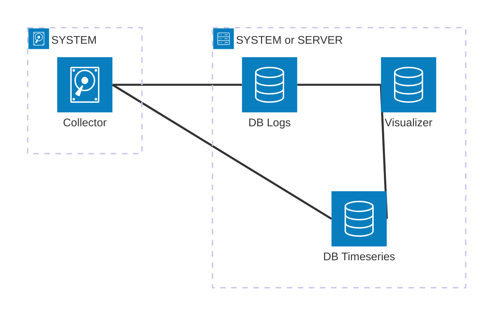

## Table of contents

- [Table of contents](#table-of-contents)
- [Description](#description)
- [Telemetry](#telemetry)
  - [Metrics](#metrics)
  - [Logs](#logs)
  - [Traces](#traces)
- [Why implement observability?](#why-implement-observability)
- [Basic architecture](#basic-architecture)
- [References](#references)
- [Some tools](#some-tools)

## Description

Observability is the capability to **understand a system's internal workings** by **examining** its external behaviors and **outputs**, it involves collecting and analyzing telemetry data (logs, metrics, and traces) from diverse sources.

## Telemetry

Telemetry refers to data emitted from a system and its behavior. The data can come in the form of traces, metrics, and logs.

### Metrics

A metric is a **measurement of a system’s state.** Metrics are generally **collected at regular intervals** and are **used to understand** the system’s behavior **over time**.

### Logs

Logs are records of **events** that have **occurred in a system**. Logs are typically **used to understand** the system’s behavior at a **specific moment** in time.

### Traces

Traces are **records of the path a request** takes through a system. Traces are generally **used to understand** how the system behaves when **handling a request**.

## Why implement observability?

- Enables to evaluate, monitor, and improve the performance of distributed IT systems.
- Provides visibility across multiple data sources (logs, metrics, traces).
- Leads to faster, higher-quality software delivery.
- Synthesizes data from all IT layers (hardware, software, cloud infrastructure, containers, microservices, endpoints, etc.), supporting both real-time and historical analysis.

## Basic architecture

A very basic observability architecture consists of three key components:

1. **Collector**: Responsible for gathering telemetry data from the system. The choice of collector(s) depends on the types of telemetry you need (such as metrics, logs, or traces) and the available system resources.
2. **Database**: Stores the collected data. In observability stacks, it is common to use specialized databases based on the type of telemetry being stored (e.g., time-series databases for metrics, log databases for logs). The database can be hosted on the monitored system itself or on a remote server.
3. **Visualizer**: Provides the ability to query the database and display the telemetry data in a user-friendly format. Visualization tools can also run locally or connect to remote servers.

## References

- [Taller de Observabilidad](https://tinitiuset.github.io/observability-lab/componentes-de-nuestro-stack-de-observabilidad.html#visual)
- [OpenTelemetry](https://opentelemetry.io/)
- [Open Metrics](https://openmetrics.io/)
- [What is observability? by Elastic](https://www.elastic.co/what-is/observability)

## Some tools

- Data collectors:
  - [collectd](https://collectd.org/): For embedded systems.
  - [OTel](https://opentelemetry.io/docs/collector/)
  - [Grafana Alloy](https://grafana.com/oss/alloy-opentelemetry-collector/?plcmt=oss-nav)
  - [cAdvisor](https://github.com/google/cadvisor): Analyzes resource usage and performance characteristics of running containers.
  - [omlibdbi (rsyslog)](https://www.rsyslog.com/doc/configuration/modules/omlibdbi.html): Provides native support, on Linux systems, for log collection and export to different databases.

- Specialized DBs:
  - [TimescaleDB](https://github.com/timescale/timescaledb): A time-series database for high-performance real-time analytics packaged as a Postgres extension.
  - [Jaeger](https://www.jaegertracing.io/): A time-series database.
  - [Prometheus](https://grafana.com/oss/prometheus/?plcmt=oss-nav): A time-series database.
  - [Grafana Tempo](https://grafana.com/oss/tempo/?plcmt=oss-nav): Tracing backend.
  - [Grafana Loki](https://grafana.com/oss/loki/?plcmt=oss-nav): Log aggregation system.

- Visualizers:
  - [Grafana](https://grafana.com/docs/grafana/latest/)
