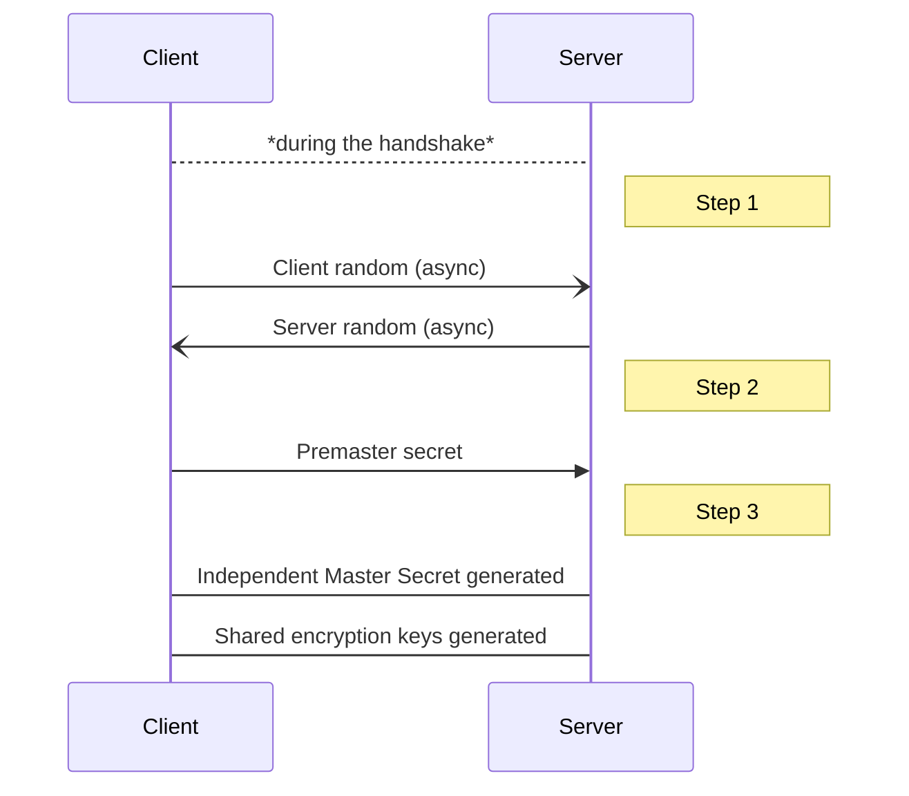
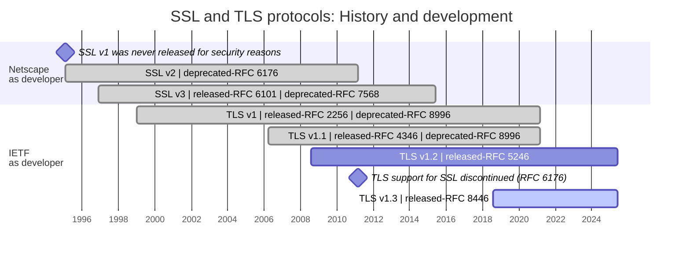

On this article you will see an overview of SSL (Secure Sockets Layer) and TLS (Transport Layer Security) protocols. Knowing what they are, what they are used for, and how they work.

## Table of contents

- [Table of contents](#table-of-contents)
- [What are SSL (Secure Sockets Layer) and TLS (Transport Layer Security)?](#what-are-ssl-secure-sockets-layer-and-tls-transport-layer-security)
- [Why is SSL/TLS necessary?](#why-is-ssltls-necessary)
- [How SSL/TLS Secures Communications?](#how-ssltls-secures-communications)
  - [Encryption](#encryption)
    - [Symmetric Encryption: TLS encryption method](#symmetric-encryption-tls-encryption-method)
    - [How DEKs are generated](#how-deks-are-generated)
  - [Authentication](#authentication)
  - [Data integrity](#data-integrity)
    - [Message Digests](#message-digests)
    - [Message Authentication Code (MAC) and Hash-Based MAC (HMAC)](#message-authentication-code-mac-and-hash-based-mac-hmac)
- [SSL/TLS certificates](#ssltls-certificates)
  - [What is an certificate?](#what-is-an-certificate)
  - [Contents of TLS Certificates](#contents-of-tls-certificates)
  - [Types of web SSL/TLS certificates](#types-of-web-ssltls-certificates)
  - [Levels on web domains SSL/TLS certificates](#levels-on-web-domains-ssltls-certificates)
  - [Quick Introduction to Certificate Authorities (CA)](#quick-introduction-to-certificate-authorities-ca)
    - [*Chain of Trust* model](#chain-of-trust-model)
  - [Self-Signed Certificates or *Direct Trust* model](#self-signed-certificates-or-direct-trust-model)
- [TLS handshake process](#tls-handshake-process)
  - [Cipher Suites](#cipher-suites)
- [SSL/TLS history and evolution](#ssltls-history-and-evolution)
- [Conclusion](#conclusion)
- [References](#references)
  - [Tools](#tools)

## What are SSL (Secure Sockets Layer) and TLS (Transport Layer Security)?

**SSL is the direct predecessor of TLS. TLS is an encryption-based Internet security protocol** that facilitates data privacy and security on [client/server](https://en.wikipedia.org/wiki/Client%E2%80%93server_model){:target="_blank"} communication.

> SSL and TLS are often used interchangeably due to their close relationship, with some referring to SSL as TLS and others SSL/TLS.
{: .prompt-info }

Also, TLS does not require the two parties to coordinate in advance and out-of-band of the TLS session, for securing the session.

The most common use case is the encrypting the communication between web applications and servers.

> A website that implements TLS on top of HTTP has *HTTPS* in its URL instead of *HTTP*.
{: .prompt-info }

{: .light}
{: .dark}
_http vs https comparative diagram_

## Why is SSL/TLS necessary?

Initially, data on the Web was transmitted in plain text so anyone could read it if they intercepted the message. For example, if a user placed an order online and entered their credit card number on the website, that credit card number traveled over the Internet without being hidden.

In addition, cibercriminals will often try to create fake websites to trick users and steal data.

Another very common attack is the "man-in-the-middle", which manipulates data in transit.

## How SSL/TLS Secures Communications?

The TLS protocol has three main functions:

- **Encryption**: Hides the data being transferred from third parties, providing **privacy and confidentiality** (see [eavesdropping](https://en.wikipedia.org/wiki/Eavesdropping){:target="_blank"}).
- **Authentication**: Thanks to the process called ***handshake***, ensures that the parties exchanging information are who they claim to be.
- **Data integrity**: Digitally signing the data, verifies that the data has **not been falsified** or tampered with (see [message forgery](https://en.wikipedia.org/wiki/Message_forgery){:target="_blank"}).

### Encryption

#### Symmetric Encryption: TLS encryption method

TLS uses symmetric encryption for data encryption. This means that both, the client and the server, use the same encryption key (called *shared encryption keys*) for encrypt and decrypt data.

TLS uses two DEKs for a TLS session, one for each direction of communication.

> A key uses for data encryption is called [DEK](https://security.stackexchange.com/questions/93886/dek-kek-and-master-key-simple-explanation){:target="_blank"} (Data Encryption Key)
{: .prompt-info }

{: .light}
{: .dark}
_TLS uses a different encryption key for Each direction_

Once the TLS connection its done, the two entities generate a new pair of DEK keys (also know as *session keys*) and these keys are used to encrypt/decrypt data throughout the session. When the connection end the keys expire.

#### How DEKs are generated

The keys are "independently" created at both end during the TLS [handshake](#tls-handshake-process).

Generation steps:

1. **Random number generation:** The client and server generate a random number (called *client random* and *server random* respectively) and send it to each other.
2. **Premaster secret generation:** Once the client has the *server random* generate another random number (called *premaster secret*). To **send** this number to the server the client **used asymmetric encryption**.

> Asymmetric encryption uses a public-private key pair for encryption, where the two encryption keys are related; A message encrypted using either key can be decrypted using the other key.
>
> The client uses the server’s public key, obtained from the server’s certificate, to encrypt the premaster secret, before sending it to the server. The server decrypts it using the related private key it holds on its side.
{: .prompt-info }

3. **Master secret and keys generation:** Using *client random*, *server random* and *premaster secret* client and server create the Master secret. Both use the master secret to generate the session keys.

| Key name         | Definition                                                      |
|------------------|-----------------------------------------------------------------|
| Client MAC Key   | The secret data used to authenticate data written by the client |
| Server MAC Key   | The secret data used to authenticate data written by the server |
| Client write key | The key used to encrypt data written by the client              |
| Server write key | The key used to encrypt data written by the server              |

> MAC - Message Authentication Code
{: .prompt-tip }

### Authentication

TLS assures the client of the server’s identity. To do so, at the beginning of the connection **client request server’s public key certificate**.This certificate, preconfigured on the server side, binds the server's identity (DNS name, etc.) to its public key.

> Authentication occurs during the TLS handshake.
{: .prompt-tip }

TLS has two type of authentication:

- One-way: Only the client who verifies the identity of the server.
- Two-way (mutual authentication): Both verify each other's identity.

### Data integrity

The idea is not only to encrypt the message and verify the identity of the client and server, but also to authenticate the content of the encrypted message itself.

TLS **ensures** that the server **receives the same message that** the client **has sent**, and the other way around. **TLS use a MAC** (Message Authentication Code) algorithm for message integrity and authenticity. It detects any loss, deliberate modification, or tampering of messages during data exchange.

#### Message Digests

To understand the MAC, it is first necessary to know what a message digests is. A message digest is a one-way and irreversible cryptographic hash of a message.

> To create the hash a cryptographic a *hash function* (e.g. MD5, SHA-1, SHA-256...) is used.
{: .prompt-tip }

Steps to send a message:

1. **Get the hash code** of the data. The sender use a message digest algorithm.
2. **Send the data with** the obtained **hash** added to it.

To verify the data by the receiver:

1. Use the received data to create an other hash code.
2. Compare obtained code with the sended one.
   - ✔️ If they are the same, the data is intact.
   - ❌ If they aren't the same, something change in transit on the data.

{: .light}
{: .dark}
_Message digest diagram_

> The problem is that, as the data is not encrypted, an attacker can modify the data and attach a new hash on the journey, and the receiver won’t know that the data has changed.
{: .prompt-danger }

#### Message Authentication Code (MAC) and Hash-Based MAC (HMAC)

A MAC is like a message digest, but it also uses the shared encryption key in the process of computing and verifying the hash. And HMAC is a newer type of MAC algorithm that uses a cryptographic hash function internally for generating the MAC.

Steps to send data:

1. Sender's plaintext **data** **goes** through a **symmetric encryption algorithm**. The encryption algorithm need as input:
   - The data.
   - The sender's shared key.
   - A random nonce or an initialization vector (IV).
2. **Generate the MAC**. The MAC algorithm need as input:
   - The encrypted data.
   - The sender's shared key.
   - The nonce or the initialization vector (IV).

> The MAC algorithm depend on the encryption algorithm:
>
>- *GMAC* if *AES-256-GCM* is used.
>- *POLY1305* does with *CHACHA20*.
{: .prompt-info }

3. **Add** the **MAC to** encrypted **data** and send it.

{: .light}
{: .dark}
_MAC authenticated encryption diagram_

To verify the data by the receiver, it need to make the reverse process:

1. Use the received data to create an other MAC code.
2. Compare obtained MAC with the sended one.
   - ✔️ If they are the same, the data is intact.
   - ❌ If they aren't the same, something change in transit on the data.
3. If the MAC is correct decrypt the data as viewed [earlier].(#symmetric-encryption-tls-encryption-method)

> Note that the same nonce is used in the encryption and decryption process. Usually the nonce is padded to the encrypted message before sending to the receiver.
{: .prompt-info }

{: .light}
{: .dark}
_MAC authentication and decryption encryption diagram_

> The MAC key used for data that the client send is called the *Client MAC Key*, in the same way the server's key is called *Server MAC Key* (On [How DEKs are generated](#how-deks-are-generated) more info).
{: .prompt-info }

## SSL/TLS certificates

> To know more about certificates check [PKI (Public Key Infrastructure)](https://en.wikipedia.org/wiki/Public_key_infrastructure) as a starting point.
{: .prompt-info }

### What is an certificate?

A digital certificate is like an passport that proves someone is who they say they are. There is where the server puts his public key. This certificate prevent a man-in-the-middle attack that swaps the server public key.

An TLS certificate is a specific type of X.509 digital certificate format stored and displayed by a server.

### Contents of TLS Certificates

Based on the [certificate of the wikipedia](/assets/img/wikipedia_certificate/wikipedia-org.cer){:target="_blank"} website (as of 30/05/2024), you can see all its parameters.

_Wikipedia certificate_

Some of these parameters are common to all X.509 TLS certificates. The most representative onces are:

<table><thead>
  <tr>
    <th>Parameter</th>
    <th>Description</th>
    <th></th>
  </tr></thead>
<tbody>
  <tr>
    <td>Subject</td>
    <td>Represents the entity that the certificate is assigned to</td>
    <td></td>
  </tr>
  <tr>
    <td>Valid from/to</td>
    <td>Period during which the certificate is valid</td>
    <td></td>
  </tr>
  <tr>
    <td>Issuer</td>
    <td>Represents the name of the CA that has signed this certificate</td>
    <td></td>
  </tr>
  <tr>
    <td>Public Key</td>
    <td>Shows the public portion of the public-private key pair used for asymmetric encryption and digital signatures</td>
    <td></td>
  </tr>
  <tr>
    <td>EKU</td>
    <td>Defines the purpose for which the public key in the certificate is intended to be used</td>
    <td></td>
  </tr>
</tbody></table>

Where:

- CN = Common name. Part of the distinguished name (DN)
- O = Organization
- OU = Organizational Unit
- L = Location
- S = State
- C = Country.

### Types of web SSL/TLS certificates

Exist three types of web TLS certificates:

- **Single Domain** Certificates: Applies only to one domain. All pages on this domain are also secured (www.example.com/about), BUT it doesn't work for subdomains (wiki.example.com).
- **Wildcard** Certificates: For a single domain and all its subdomains.
- **Multi-Domain** Certificates (MDC): Lists multiple distinct domains on one certificate. Domains that are not subdomains of each other can share a certificate.

{: .light}
{: .dark}
_TLS certificate types_

### Levels on web domains SSL/TLS certificates

An SSL certificate from any of these validation levels provides the same degree of TLS encryption; the only difference is how thoroughly the CA has authenticated the organization's identity.

Exist three levels on web TLS certificates, from lowest to highest:

- **Domain Validation** Certificates: The least-stringent level of validation, it is only necessary to prove that you own the domain. It's the cheapest validation.
- **Organization Validation** Certificates: Involves a manual research process by the CA. The certificates will contain the name and address of the organization, which makes them more reliable.
- **Extended Validation** Certificates (MDC): Involves a full background check of the organization by the CA; ensuring that it exists, that it is legally registered as a company, that it is actually present at the address it indicates... these certificates are necessary for a website's address to turn the browser URL bar green.

### Quick Introduction to Certificate Authorities (CA)

Certification authorities are trusted third parties that help to prevent the creation of fake digital certificates. A certificate must be verified and signed by a certificate authority to be considered reliable.

#### *Chain of Trust* model

In reality, there’s a chain of certificate authorities. There is a **root certificate authority**, who signs their own certificate, and signs the certificate of **an intermediate certificate authorities**. And a intermediate CA can sign the certificate of other intermediate authorities, or they can sign the end-user certificate.

_wikipedia's certificate certification path_

>The operating systems and browsers store a list of certificates of trusted root certificate authorities to easily verify the authenticity of all certificates.
{: .prompt-info }

### Self-Signed Certificates or *Direct Trust* model

When a user or developer signs his own certificate it is called self-signed certificate. As it is not a CA it is not considered a secure certificate for the rest of the people, but it is useful for testing in the first steps of a development that needs TLS certificates.

## TLS handshake process

There are three type of TLS handshake:

- **Anonymous**
- Using Certificates for **Server Authentication** only.
- **Mutual Authentication** (Certificates Exchanged on Both Sides).

_TLS's different handshakes step-by-step_

1. Once TCP communication is done, client send `ClientHello` message to server. Contains information about:
   - TLS version the client supports.
   - The cipher suites it’s equipped with.
   - The *client random* (A random byte string, more info in [this](#symmetric-encryption-tls-encryption-method) section).
2. Server respond with `ServerHello`, saying:
   - Selected TLS version.
   - Chosen cipher suite.
   - The *server random*.
3. (On Anonymous handshake) Server sends its public key in `ServerKeyExchange` message.
4. (Rest handshakes) Server sends its certificate in the `Certificate` message. Contains the server’s public key and some identity information.
5. (On Mutual handshake) Server ask to the client to authenticate on `CertificateRequest` message.
6. Server end its part of the negotiation process sending `ServerHelloDone` message.
7. Client sends its part of the key agreement protocol (depending on the selected cipher suite), which may be a public key, a Pre-Master Secret, or some other necessary information in a `ClientKeyExchange` message.
8. (On mutual handshake) Client sends a `CertificateVerify` message that contains a signature over all the previous handshake messages. This message serves as proof that the client owns the certificate.
9. to 12. Both the client and the server exchange these messages, indicating that they are moving to a secured, encrypted communication, using the parameters already exchanged.

### Cipher Suites

A cipher suite is a named **combination of cryptographic algorithms** that the client/server may use during the TLS handshake.

Servers must restrict the cipher suites that they allow as SSL/TLS includes support for cipher suites that provide minimal or even no security at all.

Here some examples:

{: .light}
{: .dark}
_TLS v1.2 cipher suite example image_

{: .light}
{: .dark}
_TLS v1.3 cipher suite example image_

## SSL/TLS history and evolution

The development of SSL starts in 1995 by Netscape. With the purpose of ensuring privacy, authentication, and data integrity in Internet communications.

In 1999 IETF (the Internet Engineering Task Force) proposed an update to SSL. Since then, IETF took the development and Netscape was no longer involved. The differences between the final version of SSL (3.0) and the first version of TLS are not drastic, the name change to indicate that it was no longer associated with Netscape.

Because of this history, the terms TLS and SSL are sometimes used interchangeably.

## Conclusion

- SSL and TLS are mostly the same, but TLS is updated.
- They are protocols to create secure client/server communications.
- TLS uses:
  - *Symmetric/shared-key encryption* for **confidentiality**.
  - A *certificate* validation process for **authentication**.
  - *MAC* (message authentication codes ) for **data integrity**.

## References

- [TLS working group overview](https://datatracker.ietf.org/wg/tls/about/){:target="_blank"}
- [The Transport Layer Security (TLS) Protocol Version 1.3 (RFC 8446)](https://datatracker.ietf.org/doc/rfc8446/){:target="_blank"} (the last one in 2024)
- [HTTP Over TLS (RFC 2818)](https://datatracker.ietf.org/doc/html/rfc2818){:target="_blank"}
- <https://en.wikipedia.org/wiki/Transport_Layer_Security>{:target="_blank"}
- <https://developer.mozilla.org/en-US/docs/Web/Security/Transport_Layer_Security>{:target="_blank"}
- <https://support.mozilla.org/en-US/kb/secure-website-certificate>{:target="_blank"}
- [Guidelines for the Selection, Configuration, and Use of Transport Layer Security (TLS) Implementations](https://nvlpubs.nist.gov/nistpubs/SpecialPublications/NIST.SP.800-52r2.pdf){:target="_blank"}
- [A Cryptographic Analysis of the TLS 1.3 Handshake Protocol](https://eprint.iacr.org/2020/1044.pdf){:target="_blank"}
- <https://en.wikipedia.org/wiki/X.509>{:target="_blank"}
- <https://www.itu.int/rec/T-REC-X.509>{:target="_blank"}
- [Internet X.509 Public Key Infrastructure Certificate and Certificate Revocation List (CRL) Profile](https://datatracker.ietf.org/doc/html/rfc5280){:target="_blank"}
- [Ravi](https://medium.com/@ravi_){:target="_blank"}'s guide:
  - [Understanding TLS Certificates](https://medium.com/demystifying-security/understanding-tls-certificates-76bdd5815d95){:target="_blank"}
  - [Making Sense of SSL/TLS](https://medium.com/demystifying-security/making-sense-of-ssl-tls-b600133f52bc){:target="_blank"}
  - [How TLS Secures Communications](https://medium.com/demystifying-security/how-tls-secures-communications-f9ba48af840a){:target="_blank"}
- [A complete overview of SSL/TLS and its cryptography system](https://medium.com/@techschool.guru/a-complete-overview-of-ssl-tls-and-its-cryptography-system-31336a85c278){:target="_blank"}
- [Understanding the TLS Handshake: A Step-By-Step Guide](https://medium.com/@fariss.omar.ensi/understanding-the-tls-handshake-a-step-by-step-guide-17c7753cc661){:target="_blank"}
- [Pre-master Secret vs Master Secret vs Private Key vs Shared Secret](https://www.baeldung.com/cs/pre-master-shared-secret-private-public-key){:target="_blank"}
- <https://www.cloudflare.com/en-gb/learning/ssl/transport-layer-security-tls/>{:target="_blank"}
- <https://www.cloudflare.com/en-gb/learning/ssl/what-happens-in-a-tls-handshake/>{:target="_blank"}
- <https://www.cloudflare.com/en-gb/learning/ssl/types-of-ssl-certificates/>{:target="_blank"}

### Tools

- [OpenSSL - Wiki](https://wiki.openssl.org/index.php/Main_Page){:target="_blank"}
- [Mozilla SSL Configuration Generator](https://ssl-config.mozilla.org/#server=nginx&version=1.17.7&config=modern&openssl=1.1.1k&guideline=5.7){:target="_blank"}
